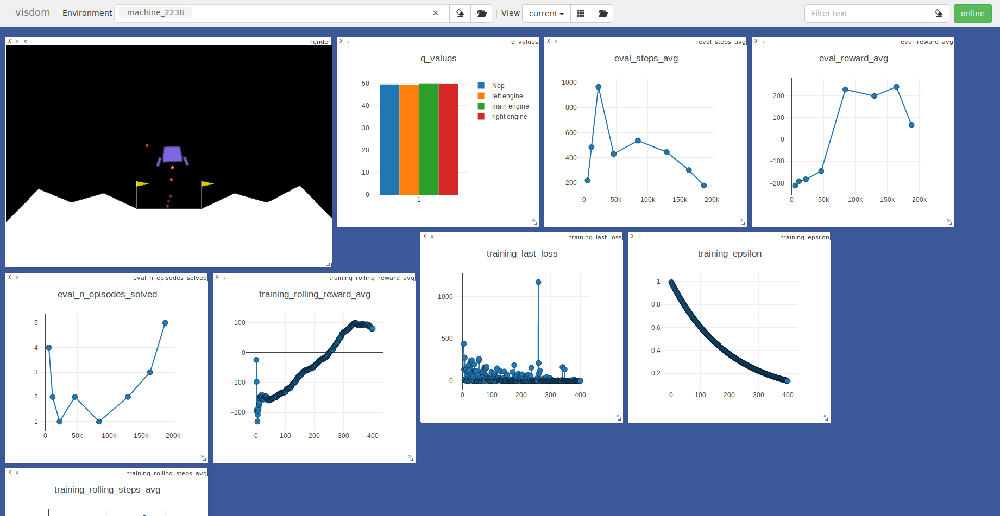

# drl_pytorch

## Requirements

* docker
* nvidia-docker

If you want to install all requirements on your machine, docker image use :
* python 3.6
* pytorch 0.4.1
* and all requirements listed in `docker/requirement.txt`

### Dashboard
Docker or not, this project use [visdom](https://github.com/facebookresearch/visdom) for visualizing plots in real-time




## Installing

### To build Docker image

```
cd docker/
docker build -t drlnd_image .
```

## Usage

### Visdom

On the host machine, in another terminal session, if you want to visualize the training, you need to run 
```
python -m visdom.server
``` 

### Docker 

If you don't want to use docker with root, please had the `--user` parameter
```
docker run --runtime=nvidia -it --rm -v $PWD:/workdir -w /workdir --network=host --user="$(id -u):$(id -g)" drlnd_image [CMD-see-below]
```

#### CLI


#### Running the tests
```
python setup.py pytest
```